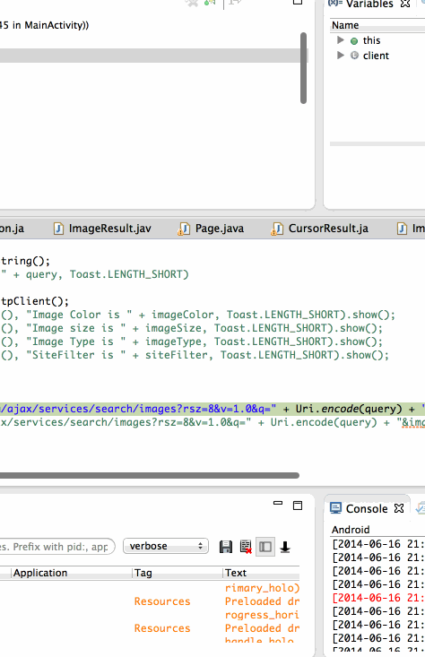

GridImageSearch
===============
1.Hours Spent : 13 hrs 

2.
* [x] User can enter a search query that will display a grid of image results from the Google Image API.
* [x] User can click on "settings" which allows selection of advanced search options to filter results
* [x] User can configure advanced search filters such as:
* [x] Size (small, medium, large, extra-large)
* [x] Color filter (black, blue, brown, gray, green, etc...)
* [x] Type (faces, photo, clip art, line art)
* [x] Site (espn.com)
* [x] Subsequent searches will have any filters applied to the search results
* [x] User can tap on any image in results to see the image full-screen
* [x] User can scroll down “infinitely” to continue loading more image results (up to 8 pages)

3.

 
